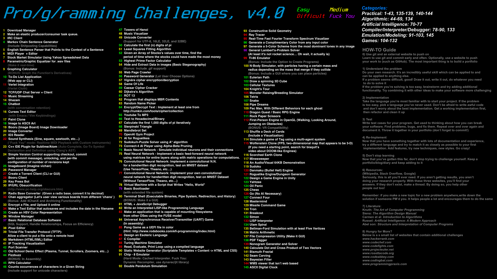

# Programming Challenges

This repository consist of my soluion to this programming challenge.

## Language

I am going to use C++ for these challenges.

## Solved

-   [x] 66 Text to Hexadeciaml/Binary
-   [x] 59 Caesar Cipher Cracker
-   [x] 44 Count occurance of characters in a Given String

## Social
